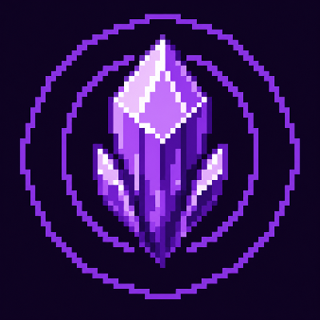

  

<h1 align="center">Resonance — Amethyst Overhaul</h1>

  <strong>Echoes of the Past</strong> 
  A progression-driven Minecraft adventure built around amethyst, sound, and the memories buried inside geodes.

  
  
  
  
  

> **Official downloads are available only from [CurseForge](https://www.curseforge.com/minecraft/mc-mods/resonance-amethyst-overhaul) and [Modrinth](https://modrinth.com/mod/resonance-amethyst-overhaul).** GitHub is used for source code, documentation, and issue tracking; release files are not distributed here.

## Echoes of the Past

Amethyst remembers every impact, every creature, and every battle. Resonance turns that idea into a complete progression path: repeated strikes build power, sweeping attacks carry it through groups, and defeated resonating creatures may fracture into dangerous echoes.

Follow those echoes into calcite-rich geodes and the Crystal Forest, craft new equipment, discover unfamiliar crystal life, and uncover what has been waiting beneath the world.

## Features

- **Resonance combat** — Build and spread Resonance with weapons, arrows, tools, potions, and specialized abilities.
- **A complete crystal ecosystem** — Crystal forests, animated foliage, varied trees, flowers, dirt variants, farmland, wildlife, spires, and massive geodes.
- **New creatures** — Crystal Rabbits and Armadillos alongside Shattered Echoes, Resonant Stalkers, Crystal Sentinels, and the Crystal Wraith.
- **Meaningful progression** — New equipment, armor, mount armor, utility blocks, food, loot, recipes, advancements, and exploration rewards.
- **A climactic encounter** — Face The Harmonic in a generated arena during a multi-phase boss fight with custom attacks, summons, music, and persistent multiplayer-safe state.

<strong>Boss encounter details — spoilers</strong>

The Harmonic tests every part of the Resonance progression. Its encounter combines protective shields, summoned Sentinels, harmonic anchors, beams, shockwaves, ground spikes, crystal rain, and escalating phase transitions.

## Installation

1. Install the supported version of Minecraft and NeoForge.
2. Download Resonance from CurseForge or Modrinth using the links above.
3. Place the downloaded JAR in your Minecraft `mods` folder.
4. Launch the game and begin by exploring amethyst geodes.

### Compatibility

| Minecraft | Loader | Status |
| --- | --- | --- |
| 26.1.2 | NeoForge 26.1.x | Available |
| 26.2 | NeoForge | In preparation |
| 26.1.2 / 26.2 | Fabric | In preparation |

The download pages are the source of truth for supported versions. Resonance currently requires Java 25.

## Support and development

- Found a bug? [Open a bug report](https://github.com/notverycomfy/resonance-amethyst-overhaul/issues/new?template=bug_report.yml).
- Have an idea? [Suggest a feature](https://github.com/notverycomfy/resonance-amethyst-overhaul/issues/new?template=feature_request.yml).
- See [CONTRIBUTING.md](CONTRIBUTING.md) before submitting code changes.
- Read the full release history in [CHANGELOG.md](CHANGELOG.md).

To build the project locally, use `./gradlew build`. The generated development JAR appears in `build/libs`; it is not an official release.

## License

Resonance is distributed under an [All Rights Reserved license](LICENSE). Forks are permitted only for contributing pull requests; redistribution and public derivative works require explicit permission.
